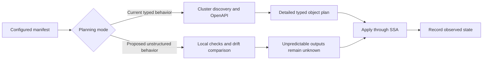

# Should unstructured manifest planning live in `kubernetes_manifest` or a new resource?

**Document:** RCA, feasibility assessment, and proposed design decision.

**Date:** 2026-09-15. **Status:** Recommendation for review; no resource implementation or public API change is made by this document.

**Repository:** `hashicorp/terraform-provider-kubernetes`.

**Evidence baseline:** local `main` at `28fb611cb6be20c5059efadd6cbf16b9ad64cd6c`, branch `feat-k8s-manifest-yaml` at `7c40dc170d2c04d8bbf5aca376ab9a8524a2e8c3`, including the existing uncommitted manifest-YAML changes. Local `main` is the comparison baseline, not a claim about the current remote branch. External documentation was checked on the document date; community-provider default-branch documentation is not a tested release compatibility promise.

## Verdict

Integrating this capability into **`kubernetes_manifest` is feasible in principle and is the preferred long-term design**, subject to compatibility and drift proof. Retain its existing behavior by default and offer an explicit unstructured planning mode. Move the existing resource from its raw protocol implementation to Plugin Framework in a separately verifiable step. Framework migration and unstructured planning solve different problems.

Recommend the proposed attribute **`planning_mode = "typed" | "unstructured"`**, defaulting to `"typed"` on the existing resource. The name describes the whole planning contract: schema discovery, output typing, preflight requests, and drift calculation. It is a provider-specific proposal inspired by the separation of concerns in Kubernetes, Helm, and community providers; it is not an established upstream attribute. The earlier proposed value `"deferred"` is understandable, but `"unstructured"` avoids confusion with Terraform's separate protocol deferral capability.

The goal behind `kubernetes_manifest_yaml` is valid: let users deploy controller/operator installation objects, CRDs, and custom resources without needing the custom-resource schema before the first plan. However, the branch is currently **a YAML-oriented alternative, not a verified drop-in replacement for `kubectl_manifest`**. Matching `yaml_body` does not establish configuration, behavior, output, or state compatibility.

If the same-name compatibility proof fails, or maintainers intentionally want a new output/lifecycle contract, **a separate Framework resource is a reasonable fallback**. `kubernetes_manifest_v1` can provide that isolation, but `_v1` would mean a new Terraform resource contract rather than a Kubernetes API version. That exception must be explicit. Renaming alone does not solve unknown values, drift, SSA ownership, or migration.

Do not ship `kubernetes_manifest`, `kubernetes_manifest_v1`, and `kubernetes_manifest_yaml` as three indefinitely overlapping full-lifecycle resources without a documented ownership and maintenance strategy. Keep `kubernetes_manifest_patch` separate: partial ownership of an existing object is a distinct lifecycle.

## Product goal and boundaries

The intended workflow is:

1. Plan against an accessible Kubernetes cluster even when some required CRDs are not installed yet.
2. Apply namespaces, RBAC, CRDs, and controller/operator workloads in dependency order.
3. Wait for CRD establishment and any required controller or webhook readiness.
4. Apply the dependent custom resources using SSA.
5. Refresh, detect relevant drift, update, import, and destroy these objects through Terraform.

“Any controller/operator/CRD” means arbitrary named Kubernetes API objects supported by the target cluster and the caller's permissions. It does not mean executing an arbitrary installer script, rendering a Helm chart, resolving every dependency in a YAML bundle, or managing unsupported subresources. One manifest resource continues to own one object. Resource count and `for_each` keys must be knowable during planning.

A new cluster whose endpoint or credentials are unknown is a separate provider-configuration problem. This proposal does not claim to solve cluster provisioning, provider initialization, CRD registration, and every dependent workload in every ordinary single apply. The current Framework provider still obtains clients from SDKv2 provider metadata. See [provider configuration](../internal/framework/provider/provider_configure.go#L14).

## RCA: why the existing resource needs the cluster during planning

### SSA is already present

The existing resource calls Kubernetes with `types.ApplyPatchType`, `FieldManager`, and `Force` during creation and update. Its effective default field manager is case-sensitive `"Terraform"`; conflict forcing defaults to false. The new YAML resource also uses SSA, with a different default manager, `"terraform"`. See [legacy apply](../manifest/provider/apply.go#L376), [legacy defaults](../manifest/provider/plan.go#L74), and [YAML schema](../internal/framework/provider/manifestyaml/schema.go#L34).

The problem is therefore not the absence of SSA. It is the coupling between Kubernetes schema discovery and Terraform's planned `object` value.

### The failure mechanism

The legacy plan resolves the manifest's Group/Version/Kind, checks namespace/scope information, obtains a Kubernetes schema, converts the configured manifest to that schema's Terraform type, and fills unspecified fields with appropriately typed unknown values. A missing CRD or an unknown `apiVersion` can prevent that process before apply begins. `depends_on` orders operations but does not cause a missing CRD to exist while all resources are being planned. See [planning](../manifest/provider/plan.go#L288), [schema construction](../manifest/provider/plan.go#L337), and [type conversion](../manifest/provider/plan.go#L383).



Normal refresh is an additional cluster interaction before planning; it is not depicted as an offline operation in this diagram.

Schema dependence also exists in [Read](../manifest/provider/read.go#L109), [state upgrade](../manifest/provider/upgrade_state.go#L87), [import](../manifest/provider/import.go), and [apply](../manifest/provider/apply.go#L181). Removing one validation call from `PlanResourceChange` cannot remove all these dependencies.

Both legacy `manifest` and `object` already use `DynamicPseudoType` in the protocol schema. The implementation then chooses a concrete output type using OpenAPI. Framework's `DynamicAttribute` makes implementing another policy practical, but the raw protocol also has the underlying capability. See [current schema](../manifest/provider/provider.go#L180).

### How the linked issues relate

| Discussion | Root issue | What this proposal can address |
| --- | --- | --- |
| [#1583](https://github.com/hashicorp/terraform-provider-kubernetes/issues/1583) | Unknown identity information or a custom-resource API unavailable while planning. | Unstructured planning can postpone schema-dependent work until apply. CRD establishment and dependency ordering are still required. |
| [#2894](https://github.com/hashicorp/terraform-provider-kubernetes/issues/2894) | Observed/stale annotation values may enter the SSA payload through planned `object` and `computed_fields` handling. | Construct requests from desired configuration, keeping observed output separate. This is a payload-ownership correction, not a reason to enable SSA again. |
| [#2769](https://github.com/hashicorp/terraform-provider-kubernetes/issues/2769) | Schema lookup uses CRD inspection and OpenAPI v2; the request proposes OpenAPI v3. | Improve the retained typed path independently. A better schema endpoint still cannot describe a CRD that does not yet exist. |
| [PR #1802](https://github.com/hashicorp/terraform-provider-kubernetes/pull/1802) | Server-side fields were removed from generic data-source results. | Relevant to exposing observed status. It changes `kubernetes_resource` data-source output, not manifest planning or SSA selection. |

The legacy apply code begins with planned `object`, then backfills configured values and removes some structural placeholders. The new YAML code builds its request directly from `yaml_body`, which avoids that particular observed-data replay path. This is a useful design direction, but it does not by itself fix ignored-field ownership. See [legacy payload construction](../manifest/provider/apply.go#L162) and [YAML payload construction](../internal/framework/provider/manifestyaml/crud.go#L26).

### Helm supports the direction, with a different planning contract

Helm 4 defaults new releases to SSA; upgrades and rollbacks normally follow the previous release's apply method. Helm separately exposes OpenAPI-validation and dry-run controls. The local Helm provider checkout uses Helm SDK v3.18.5, so Helm 4 behavior must not be attributed to that checkout. See [Helm 4 overview](https://helm.sh/docs/overview/#server-side-apply), [Helm install options](https://helm.sh/docs/helm/helm_install/), and [HIP-0023](https://helm.sh/community/hips/hip-0023/).

Terraform must also preserve its approved plan. Delegating merge and ownership decisions to Kubernetes does not allow a provider to return arbitrary changes to known planned values. That contract is the additional engineering work in this proposal.

## `kubernetes_manifest` versus the resource on this branch

| Dimension | Existing `kubernetes_manifest` | Branch `kubernetes_manifest_yaml` |
| --- | --- | --- |
| Implementation | Raw plugin protocol server; exposed through the protocol-6 mux | Plugin Framework; same mux |
| Main input | Required dynamic HCL `manifest`; YAML through `yamldecode()` | Required `yaml_body` string containing one YAML/JSON object |
| Apply operation | SSA | SSA |
| Default manager | `Terraform` | `terraform` |
| Plan-time OpenAPI | Used to construct detailed Terraform types | Not used |
| Plan-time SSA dry-run | Special fallback for non-structural resources | Existing-object plans normally use a forced dry-run; selected changes also use an unforced conflict preview |
| New CRD before first plan | Often prevents planning its custom resources | Create planning skips remote preview; apply still needs the CRD endpoint |
| Partial unknowns | An HCL object can retain known identity while nested values are unknown | One unknown interpolation can make the entire string unknown |
| Main observed output | Schema-shaped dynamic `object`; preserves the legacy filtering contract | Canonical JSON `live_manifest` for projected owned fields, JSON `status`, and identity fields |
| Status | Removed from managed-resource `object`; generic data sources are a separate surface | Explicit JSON `status` attribute |
| Server metadata | Selected fields are filtered from legacy `object` | Exposes `uid` and `resource_version` separately |
| Mutation handling | `computed_fields` allows selected output values to differ from configured intent | Desired YAML remains separate; drift uses managed-field projection |
| Ignoring changes | Existing `computed_fields` and Terraform lifecycle semantics | `ignore_fields` currently affects projection, not the sent payload |
| Replacement | Legacy identity/type and planning rules | Known YAML identity changes and `force_replace_on` paths |
| Wait syntax | Legacy `wait` block, nested `condition` blocks, and deprecated `wait_for` | Different single `wait` block; condition is a string |
| Import | Legacy import identifier and resource identity support | Key/value identifier; imported YAML is null; lifecycle defects remain |
| Refresh connectivity | Required for existing resources | Required for existing resources |
| Plain output sensitivity | Generic manifest/object values are not universally redacted | `yaml_body` and `live_manifest` are not schema-marked sensitive |

The code backing this comparison is the [legacy schema](../manifest/provider/provider.go), [server-field filtering](../manifest/provider/resource.go#L183), [YAML schema](../internal/framework/provider/manifestyaml/schema.go), [YAML planning](../internal/framework/provider/manifestyaml/crud.go#L214), and [YAML projection](../internal/framework/provider/manifestyaml/projection.go).

The branch currently avoids OpenAPI-derived typing, but does not provide an unconditional “no server validation during plan” contract: immutable-field errors from its dry-run can fail an update plan. Other preview failures may be ignored, while a failed refresh can still stop the command.

There is no registered `kubernetes_manifest_v1` in this baseline. Resource schema version `1`, resource identity version `1`, Kubernetes `apiVersion`, and plugin protocol version are four distinct concepts.

## Candidate designs and decision

The governing compatibility principles are preserving shipped configuration/state by default (`K8S-MIGRATE-001` and `K8S-MIGRATE-023`), registering each resource under one mux owner (`K8S-NAMING-004`), and preserving the existing public name during migration (`K8S-NAMING-003`). These are team-domain guidelines; the checked-out [contributor guide](CONTRIBUTING.md) and actual raw manifest contract take precedence. SDKv2-specific conversion recipes do not automatically apply to this raw-protocol resource.

### Candidate A: integrate with the existing name

**Shape:** Move `kubernetes_manifest` to Framework with unchanged legacy blocks, attributes, output types, and effective defaults. Add optional `planning_mode`, default `typed`; provide `unstructured` as an explicit opt-in. Keep HCL input first; assess an alternative `yaml_body` input as a separately tested additive step.

**Consequence for users:** Existing resource addresses and HCL remain valid. Users opt into fewer plan-time guarantees. YAML configurations can use `yamldecode()` immediately; preserving the literal `yaml_body` argument requires the additional input work.

**Consequence for us:** One long-term generic manifest resource, but two planning policies and a substantial compatibility test matrix. Framework migration must be independently reviewable from changed behavior.

**Rules it touches:** `K8S-MIGRATE-001`, `K8S-MIGRATE-023`, `K8S-NAMING-003`, `K8S-NAMING-004`.

### Candidate B: introduce `kubernetes_manifest_v1`

**Shape:** Add a new Framework resource with HCL `manifest`, an optional alternative YAML input if selected, and explicit `planning_mode`. Keep the existing raw-protocol resource registered and unchanged. The new resource can use a computed-only output contract instead of inheriting configured `object` behavior.

**Consequence for users:** Existing configurations remain isolated from the redesign. Adoption requires an explicit resource-type/state migration. For the new name, an `unstructured` default is reasonable if that is its advertised purpose, but the new default must be selected and documented rather than inherited accidentally.

**Consequence for us:** Two full-lifecycle manifest implementations and a migration path to support. A new name permits a cleaner contract but does not reduce the hard SSA/drift work. Version naming needs a documented exception.

**Rules it touches:** `K8S-MIGRATE-023`, `K8S-NAMING-003`, `K8S-NAMING-004`; state-move rules apply if migration is offered.

### Candidate C: harden and retain `kubernetes_manifest_yaml`

**Shape:** Keep the branch's raw-YAML resource, repair its lifecycle and projection problems, and define a compatibility profile for selected `kubectl_manifest` configurations. Keep `kubernetes_manifest` unchanged. Share validated Kubernetes utilities with the patch resource.

**Consequence for users:** Familiar YAML input and minimal changes for basic configurations. HCL, wait, output, deletion, and state migration differences remain explicit. Existing manifest users get no new capability without adopting another resource.

**Consequence for us:** Fastest reuse of this branch, but continued support of two generic full-lifecycle resources. A genuine drop-in promise adds community-version-specific compatibility work.

**Rules it touches:** `K8S-NAMING-004`, `K8S-MIGRATE-023`, `K8S-DOCS-001`; the generic manifest naming exception must be explicit rather than applying typed API-version conventions mechanically.

### Candidate D: implement unstructured planning in the raw server first

**Shape:** Keep `kubernetes_manifest` on its current protocol implementation, add the same opt-in mode there, and migrate to Framework later. Reuse dynamic protocol types already present.

**Consequence for users:** The desired capability can arrive without changing the serving library. The same input/output compatibility constraints still apply.

**Consequence for us:** Separates behavior from migration, but adds new behavior to code intended for retirement and creates a later porting task. This is a credible delivery option if compatibility-preserving Framework work is the schedule bottleneck.

**Rules it touches:** `K8S-MIGRATE-023`, existing raw-protocol contract, and `K8S-NAMING-004` when the later move happens.

### Scoring, in priority order

| Criterion | A: existing name in Framework | B: new `_v1` | C: YAML resource | D: raw server first |
| --- | --- | --- | --- | --- |
| Existing-user compatibility | Conditional on parity proof; default unchanged | Strong isolation; adoption is explicit | Strong isolation; adoption is explicit | Conditional on default-path proof |
| Domain rules | Fits same-name migration | Requires generic naming rationale | Fits deliberate YAML interface | No requirement to migrate merely to enable this |
| Fidelity to goal | Strong unified API | Strong new API | Strongest raw-YAML starting point | Strong behavioral fit |
| Drift/import | Must solve new drift and old-state compatibility | Must solve drift and state conversion | Current defects plus conversion | Must solve drift and old-state compatibility |
| Consistency | Preserves existing manifest surface | Adds a second generation | Adds format-specific surface | Preserves surface |
| Maintenance | Higher initial cost; least long-term duplication | Long-term dual surface | Long-term dual surface | Lower migration coupling now; additional later port |

**Decision:** prefer A, staged as parity migration followed by opt-in behavior. Do not select B merely because the resource moves to Framework. Select B if concrete parity/output-contract evidence makes a new generation preferable. Select C if retaining the community YAML interface is a stronger immediate product requirement than unifying on the existing name. Select D if delivering the behavior first is demonstrably cheaper than a parity-first migration.

**Why the alternatives are not the default recommendation:** B and C introduce another public lifecycle to maintain; no evidence currently proves that necessary. D postpones the requested modernization and risks implementing the new behavior twice. A remains conditional: failing its compatibility gate reopens this decision instead of justifying a silent breaking change.

### Resource naming decision

| Name | Verdict |
| --- | --- |
| `kubernetes_manifest` | Preferred unified resource; moving to Framework does not require renaming it. |
| `kubernetes_manifest_yaml` | Accurate if raw YAML remains a deliberately separate public interface. The clarified community-migration goal gives this name a useful purpose beyond schema behavior. |
| `kubernetes_manifest_v1` | Acceptable as an explicitly chosen successor-contract name, with migration support and a documented exception to API-version naming. It should still accept manifests whose Kubernetes `apiVersion` is not `v1`. |
| `kubernetes_manifest_raw` or `kubernetes_manifest_unstructured` | Reasonable alternatives if separation is about representation and planning rather than a new contract generation. Renaming the existing branch does not remove its compatibility work. |
| `kubernetes_manifest_ssa` | Avoid: SSA does not distinguish it from the existing resource. |

## Attribute naming and community precedent

The community precedents separate several independent concepts:

| Source | Existing controls | What to borrow |
| --- | --- | --- |
| [Kubernetes `kubectl apply`](https://kubernetes.io/docs/reference/kubectl/generated/kubectl_apply/) | `--server-side`, `--validate=strict\|warn\|ignore`, `--dry-run=client\|server\|none` | Apply method, field validation, and preflight are different choices. |
| [Helm install](https://helm.sh/docs/helm/helm_install/) | `--server-side`, `--disable-openapi-validation`, `--dry-run`; also chart `--skip-schema-validation` | Keep Kubernetes schema validation distinct from chart-values validation and execution simulation. |
| [gavinbunney `kubectl_manifest`](https://github.com/gavinbunney/terraform-provider-kubectl/blob/master/docs/resources/kubectl_manifest.md) | `server_side_apply`, `validate_schema`, `force_conflicts` | Familiar booleans are useful when they control one behavior. |
| [alekc `kubectl_manifest`](https://github.com/alekc/terraform-provider-kubectl/blob/master/docs/resources/kubectl_manifest.md) | The preceding controls plus documented `drift_engine=client\|server` | A server-backed drift preview can be separately selectable. Current branch documentation is not release-version proof. |
| [AzAPI resource](https://github.com/Azure/terraform-provider-azapi/blob/main/docs/resources/resource.md) and [provider](https://github.com/Azure/terraform-provider-azapi/blob/main/docs/index.md) | `schema_validation_enabled` and separate `enable_preflight` | Schema checking and remote preflight should not be conflated. |
| [Terraform plan](https://developer.hashicorp.com/terraform/cli/commands/plan) | Normal, destroy, and refresh-only planning modes; refresh control | A resource attribute must not imply that it overrides Core's planning mode or refresh behavior. |

These sources establish naming precedents, not an existing attribute that exactly implements the proposal.

| Candidate attribute | Assessment |
| --- | --- |
| `planning_mode = "typed" \| "unstructured"` | **Recommended.** Selects two documented combinations of typing, preflight, and drift behavior. Explain that this is resource-specific planning. |
| `schema_mode = "openapi" \| "unstructured"` | Good runner-up if the contract is specifically schema/type construction. By itself it does not imply disabling SSA dry-runs. |
| `schema_validation = "plan" \| "apply"` | Understandable timing, but understates changed output typing and drift behavior; can be confused with validation strictness. |
| `validate_schema = false` | Familiar from kubectl providers, but misleading if it also switches output representation and drift algorithms. Kubernetes still validates writes. |
| `disable_openapi_validation = true` | Familiar from Helm, but skipping validation does not explain removing a required type-construction step. |
| `plan_validation = false` or `skip_plan_validation = true` | Suggests all planning checks can be disabled. Local identity and Terraform consistency checks must remain. |
| `server_side_apply = true` or `ssa = true` | Inaccurate for this feature: SSA is already the existing apply method. |
| `planning_mode = "deferred"` | Usable with careful documentation, but overloaded with the current provider's actual `Deferred` RPC responses. |

Start with two explicit supported combinations rather than exposing every theoretical boolean combination. Do not silently add server-side drift dry-runs to `unstructured` later; that would change its bootstrap and RBAC contract. A future preview option requires a separate design decision.

### Proposed normative mode contract

This table is the design target. It is not the current behavior of the YAML branch.

| Operation or guarantee | `typed` on existing resource | Proposed `unstructured` |
| --- | --- | --- |
| Default on existing name | Yes | Explicit opt-in |
| Parse input / validate local structure | Yes | Yes, when inputs are known |
| Fetch OpenAPI to construct planned output | Existing behavior | No |
| Require CRD schema before create plan | Existing behavior | No |
| Server dry-run during resource planning | Preserve existing fallback behavior | No |
| Normal refresh of existing state | Existing discovery, GET, and typing behavior | Discovery/GET for observations; no OpenAPI dependency and no SSA preflight after mode transition |
| Drift calculation | Preserve current behavior | Desired/applied-field baseline versus refreshed observations; no dry-run |
| Unpredictable server output during an actual change | Existing detailed plan | Unknown value/type where the configured-output contract permits |
| Apply | Existing SSA behavior | Discovery, SSA, server validation/admission, and configured waits |
| Kubernetes permissions | Existing permissions | Discovery/read plus required lifecycle permissions; no extra preview PATCH during plan |
| Terraform consistency and known identity safety | Required | Required |
| Fully offline plan for existing objects | Not promised | Not promised |

On the first `typed` to `unstructured` transition, refresh still sees the old state's mode. The table's unstructured refresh contract applies once the state has transitioned, unless a schema-free transition path is separately proven.

The proposed mode must be known before policy-dependent planning runs. Treat an absent mode in historical state as legacy `typed` behavior; do not interpret an unknown mode as a default. Removing an explicit `unstructured` setting returns to `typed` and therefore exercises the reverse-transition contract. A mode switch must not force remote replacement merely to change Terraform's representation.

## Feasibility and implementation boundaries

### Framework and version feasibility

The repository pins Go 1.26.3, Framework 1.15.1, plugin-go 0.29.0, plugin-testing 1.13.3, and mux 0.20.0. The current local CLI reports Terraform 1.15.7; that is an inspection environment, not a minimum-version promise. The mux upgrades the legacy protocol-5 servers and serves protocol 6. See [dependencies](../go.mod) and [mux](../internal/mux/mux.go).

The pinned Framework includes `schema.DynamicAttribute`, `types.DynamicUnknown`, `ResourceWithMoveState`, and `ResourceWithIdentity`. Availability of these interfaces establishes implementation feasibility, not successful migration. A cross-resource-type move requires Terraform 1.8 or later and destination-provider conversion logic. Preserve a documented import path for environments that do not use that capability. See [Framework state moves](https://developer.hashicorp.com/terraform/plugin/framework/resources/state-move).

Do not infer the oldest supported CLI from the developer's installed version. Implementation must inventory the provider's supported CLI matrix and test its existing contract at the oldest supported version and a current supported version.

### Preserve configured input and separate observed output

| Value boundary | Required behavior |
| --- | --- |
| Configured `manifest` | Preserve configured values and Terraform types; do not replace them with server defaults or observations. |
| Configured YAML, if added | Preserve its input representation under Terraform's semantic-equivalence rules; do not write live YAML into it. |
| SSA request in new unstructured mode | Serialize desired fields only, with an explicit null/omission and ignored-field ownership policy. Preserve legacy request behavior during the parity migration; fix typed-mode payload defects separately. |
| Observed `object` | Store an API observation consistent with the chosen output contract; the new unstructured path must not reuse it wholesale as future intent. |
| Planned output | Preserve known values or mark genuinely unpredictable computed values unknown before apply. |
| Post-apply state | Record the created identity even if readiness subsequently fails; return fresh observations after successful waits. |

Dynamic attributes do not waive Terraform value/type consistency. Unknownness must be chosen before apply, including whether the underlying object type is known. A string containing unknown YAML and an HCL object with one unknown leaf are different inputs. See [Framework dynamic data](https://developer.hashicorp.com/terraform/plugin/framework/handling-data/dynamic-data).

The legacy `object` is **Optional+Computed**, not computed-only. Users can technically configure it. Candidate A cannot blindly mark a configured `object` unknown or silently change it to computed-only. The compatibility spike must either preserve that contract in unstructured mode or explicitly diagnose an unsupported combination before use. A deliberate removal or redesign belongs in Candidate B or a separately approved breaking release.

For an unconfigured output in the new mode, derive its concrete shape from the observed object after apply, retaining the existing top-level server-field filtering unless an output extension is separately selected. Without OpenAPI, schema-padded null fields and schema-directed list/map types cannot be assumed identical to typed-mode output. Users who explicitly change modes may need to adapt missing-key checks or collection expressions. Record those differences as opt-in output-contract changes and test dependent expressions; same-name integration is not a promise that both modes produce identical underlying types. Default typed-mode output remains unchanged.

Preserving old state for a semantically equivalent configured string can be valid. The earlier review did not establish YAML whitespace normalization as a defect. Known planned outputs still must match the apply result. See [Terraform resource lifecycle](https://github.com/hashicorp/terraform/blob/main/docs/resource-instance-change-lifecycle.md).

### Drift is the largest unresolved engineering item

SSA determines field ownership and merge behavior when a request is sent. Terraform also needs to decide whether an Update should be scheduled. Removing the branch's dry-run removes the mechanism it currently uses for that decision.

The proposed implementation should retain a last-successful-apply baseline of the intended field set and its canonical observed values. Refresh obtains the current live object; planning compares relevant observations to that baseline and combines the result with configuration changes. Store the baseline in provider-managed state/private data supported by the protocol, not only in process memory. This is not a new Terraform persistence engine.

The comparison must distinguish changed values, deleted desired fields, manager ownership loss, server defaults, and unrelated controller fields. Merely projecting the fields the manager owns *now* is insufficient: a different manager taking a desired field must not make that desired field disappear from drift detection.

ManagedFields can help map scalar, map, and associative-list ownership, but the branch's deduced-type extraction is not sufficient. Prototype correct interpretation of field membership and list keys, with real Kubernetes fieldsets. Preserve atomic map/list boundaries and unowned siblings. Do not promise precise reconciliation for every CRD shape before this proof. If exact projection cannot be established without schema, document and test a supported conservative policy or reconsider the no-OpenAPI contract; do not silently suppress drift.

A saved plan must not promise a computed value solely because one earlier SSA dry-run returned it. Admission changes, defaults, and controller updates can change between plan and apply. For scheduled updates, unpredictable observations need unknown planned values. Imported resources and the first switch of modes need a baseline-initialization policy that preserves remote UID and does not silently accept known configured drift.

### Ignored fields, mutation, and SSA ownership

`computed_fields`, Terraform `ignore_changes`, and the branch's `ignore_fields` are different contracts. Allowing a server-mutated output is not the same as relinquishing a field or omitting it from future writes.

For controller handoff, define how an ignored path behaves on create, update, removal from configuration, and removal from the ignore list. Avoid resetting an HPA-owned replica count during an unrelated image change. Simply deleting a previously owned field from an SSA request can cause Kubernetes to delete/default it if no other manager owns it. Renaming the manager or enabling force is not a universal handoff solution. See [Kubernetes SSA field management](https://kubernetes.io/docs/reference/using-api/server-side-apply/).

### Identity, ordering, and deletion

Initial creation can accept unknown manifest content during planning because no old remote object exists. Updates require proof that the resolved identity is unchanged or a replacement already present in the plan. An apply handler cannot discover a rename and invent a destroy/create operation after approval. With partially unknown HCL, known identity can often be checked independently. Fully unknown YAML needs a tested policy: an explicit identity contract, a conservative preplanned replacement where appropriate, or an actionable diagnostic. Do not claim that returning early from `ModifyPlan` safely handles every unknown identity.

Apply CRDs before custom resources and wait for `Established=True`; wait for operator/webhook readiness where required. Kubernetes documents that discovery endpoints can appear after CRD creation. The branch resets discovery and retries once immediately, which is not a bounded establishment waiter. See [CRD establishment](https://kubernetes.io/docs/tasks/extend-kubernetes/custom-resources/custom-resource-definitions/) and [current discovery retry](../internal/framework/provider/kubemanifest/gvr.go#L75).

Persist identity separately from raw input so import, delete, and replacement do not depend on reconstructing YAML. Distinguish an object 404 from a missing API endpoint, permission failure, or unavailable server. Exercise operator finalizers and dependency-ordered destruction; deleting a CRD before its custom resources can remove more than one Terraform object.

### Same-name migration and the first mode switch

Preserve the legacy `field_manager`, `wait`, and `timeouts` list-nested block shapes, `computed_fields`, deprecated `wait_for`, import formats, identity schema/version, output filtering, and effective manager defaults. Do not copy the new resource's flattened manager options or JSON outputs over the existing schema. In particular, legacy `object` excludes `status` and selected server metadata; adding them or changing null fields to absent keys is an output-contract decision.

Move only the `kubernetes_manifest` registration to Framework. Keep generic manifest data sources on the raw server until separately migrated. Registering the same resource name on both mux servers is not a mode-selection mechanism.

Read receives prior state, not the new resource configuration. A user setting `planning_mode = "unstructured"` for the first time may still encounter a typed refresh or historical state upgrader before that new value is considered. Supported rollout must choose and prove one of these paths:

- Require the legacy state to refresh successfully for the initial switch, then persist the new mode.
- Implement schema-free refresh/upgrade for old state while preserving its established output types.
- Provide a separately tested explicit state conversion/import route for cases where the old schema is unavailable.

Do not use `-refresh=false` as evidence that the ordinary migration works. State upgrade and state move are different operations. Forward migration does not imply that an older provider can read the new state; document and test downgrade limits.

### Feasibility assessment

| Workstream | Assessment | Required proof |
| --- | --- | --- |
| Framework can accept arbitrary HCL input | Feasible with pinned capabilities | Dynamic values and unknown nested values through real protocol calls |
| New-object plan without CRD/OpenAPI | Feasible | No schema/discovery/preflight needed by the resource's create planning path |
| Same-name parity migration | Feasible in principle; substantial | Existing HCL, state, outputs, imports, UID, and default behavior preserved |
| Existing-object unstructured drift without preflight | Highest uncertainty | Defaulting, mutation, lists/maps, ownership loss, saved plans, and stable no-op plans |
| First mode switch when old schema is missing | Not solved by an attribute alone | One of the explicit transition paths above |
| Literal kubectl-provider drop-in | Not established | Versioned compatibility matrix and state transfer tests |
| Arbitrary cluster bootstrap from unknown credentials | Separate problem | Provider/client lifecycle proof; no blanket promise |

## A realistic kubectl-provider replacement contract

Distinguish three promises: **workflow replacement** (same deployment goal), **configuration migration** (documented HCL changes), and **drop-in compatibility** (specified arguments/defaults/outputs/state semantics continue to work). The branch currently supports the first goal for a subset of workflows, needs fixes and testing for production use, and does not establish the third promise.

The documented gavinbunney interface includes SSA disabled by default, schema validation enabled, rollout waiting enabled, `apply_only`, namespace override, sensitive-field masking, and `//`-separated import IDs. The alekc interface additionally documents its manager default as `kubectl`, richer waits, API-version upgrade control, and a selectable drift engine. These are distinct compatibility targets. See [gavinbunney resource contract](https://github.com/gavinbunney/terraform-provider-kubectl/blob/master/docs/resources/kubectl_manifest.md) and [alekc resource contract](https://github.com/alekc/terraform-provider-kubectl/blob/master/docs/resources/kubectl_manifest.md).

| Compatibility area | Branch status / migration requirement |
| --- | --- |
| `yaml_body` | Familiar single-object input; supports the basic rewrite of resource type. |
| `server_side_apply` | No selection; always SSA. Transition from client-side apply requires ownership tests. |
| `validate_schema` | No equivalent argument; removing OpenAPI planning is a different contract. |
| `field_manager` / `force_conflicts` | Names partly align; defaults and existing ownership may differ. Preserve the prior effective manager where required. |
| `force_new` | `force_replace_on` is a path-based control, not an argument-compatible replacement. |
| `apply_only` | No equivalent retention option. `delete { propagation_policy = "Orphan" }` retains dependents, not the managed object. |
| `override_namespace` | No equivalent; input needs rewriting or an explicitly designed option. |
| `wait_for_rollout`, `wait`, `wait_for` | Syntax, defaults, supported kinds, path grammar, and timing differ. |
| `ignore_fields` | Branch only prunes projected drift and supports simple dotted map paths; indexed list paths and keys containing dots need a defined grammar. |
| `sensitive_fields` / masking | No equivalent selective redaction. Secret-bearing inputs and derived outputs need a deliberate sensitivity policy. |
| Outputs | Branch JSON projections and identity outputs do not reproduce all community YAML/live/drift attributes. Update dependent expressions. |
| Import | Identifier formats and stored schemas differ; no automatic state conversion exists on the branch. |
| API-version upgrades | Branch compares API version as identity. Prove whether an update represents the same UID before offering in-place version conversion. |
| Multi-document files | Split into one resource per object; stable keys and explicit CRD/controller dependencies remain necessary. |
| Provider connection arguments | Resource compatibility does not establish provider-level kubeconfig/authentication/retry argument compatibility. |

If literal raw-YAML configuration migration is a firm requirement for Candidate A, add `yaml_body` as an alternative to `manifest` in a later stage: exactly one must be configured, determine selection by presence even when unknown, and preserve the original configured input. That requires changing `manifest` from Required to Optional plus validation; it must be tested as an additive schema change. Do not silently synthesize a value into an unconfigured non-computed input field. Start by allowing YAML only with explicit unstructured mode, rather than inferring the mode from the input format.

The same desired object must not be managed simultaneously by both the old and new Terraform resource. A provider-address replacement or resource rename alone cannot transform incompatible state. A destination `MoveState` implementation must allowlist the source provider/type/schema version and preserve identity; otherwise publish an explicit import/state-transfer procedure. UID continuity and request/ownership behavior both require verification. Kubernetes objects must not be recreated merely to migrate Terraform bookkeeping.

## Proposed usage

Every example in this section is **proposed HCL**. The current branch does not implement `planning_mode` on `kubernetes_manifest`.

### Existing HCL users opt into unstructured planning

This example installs a small CRD and then one custom resource on an already accessible cluster. It demonstrates dependency and establishment requirements without relying on an external controller installation.

```hcl
resource "kubernetes_manifest" "widget_crd" {
  planning_mode = "unstructured"

  manifest = {
    apiVersion = "apiextensions.k8s.io/v1"
    kind       = "CustomResourceDefinition"
    metadata = {
      name = "widgets.example.com"
    }
    spec = {
      group = "example.com"
      scope = "Namespaced"
      names = {
        plural   = "widgets"
        singular = "widget"
        kind     = "Widget"
      }
      versions = [{
        name    = "v1"
        served  = true
        storage = true
        schema = {
          openAPIV3Schema = {
            type = "object"
            properties = {
              spec = {
                type = "object"
                properties = {
                  message = { type = "string" }
                }
              }
            }
          }
        }
      }]
    }
  }

  wait {
    condition {
      type   = "Established"
      status = "True"
    }
  }
}

resource "kubernetes_manifest" "widget" {
  planning_mode = "unstructured"
  depends_on    = [kubernetes_manifest.widget_crd]

  manifest = {
    apiVersion = "example.com/v1"
    kind       = "Widget"
    metadata = {
      name      = "example"
      namespace = "default"
    }
    spec = {
      message = "managed by Terraform"
    }
  }
}
```

For operator installation, use the same resource for its Namespace, RBAC, CRDs, Service, Deployment, and webhook configuration as applicable. Make custom resources depend on the relevant CRD and ready webhook/controller resources. A single `depends_on` on CRD creation does not prove webhook readiness.

### YAML configuration migration

The first integration stage can consume YAML through the existing input shape:

```hcl
resource "kubernetes_manifest" "example" {
  planning_mode = "unstructured"
  manifest      = yamldecode(file("example.yaml"))
}
```

If the optional YAML-input stage is adopted, the intended surface would be:

```hcl
resource "kubernetes_manifest" "example" {
  planning_mode = "unstructured"
  yaml_body     = file("example.yaml")
}
```

Both snippets assume a supplied single-object `example.yaml`; neither is evidence of runtime compatibility. For partially unknown configuration, prefer HCL objects where identity can remain known independently of the unknown spec values.

### New-resource fallback

If Candidate B is selected, the corresponding opt-in could be:

```hcl
resource "kubernetes_manifest_v1" "example" {
  planning_mode = "unstructured"
  manifest      = yamldecode(file("example.yaml"))
}
```

This is a proposed successor contract, not an alias already available. A move from `kubernetes_manifest` or a community provider needs implemented state conversion or a tested import procedure. Do not document a `moved` block as working before its destination conversion is implemented and tested.

## Branch defects to address before reuse or release

These are findings from the preceding review, rechecked against the same source baseline. Isolated reproductions are handler/library evidence, not live-cluster acceptance evidence.

| Priority | Finding and trigger | Correction / required regression |
| --- | --- | --- |
| P1 | [Create](../internal/framework/provider/manifestyaml/crud.go#L122) applies successfully but returns on readiness failure before saving state. | Persist created identity and recoverable state before waiting; test timeout then destroy/retry. |
| P1/P2 | [Imported state](../internal/framework/provider/manifestyaml/crud.go#L416) has null YAML, while [identity comparison](../internal/framework/provider/manifestyaml/crud.go#L235) and [Delete](../internal/framework/provider/manifestyaml/crud.go#L332) decode YAML. | Use persisted identity; test import then destroy and import A then configure B. |
| P2 | [Projection](../internal/framework/provider/kubemanifest/projection.go#L54) can turn atomically owned maps or parent-membership fieldsets into a null value. | Correct fieldset extraction; test retained ownership with changed map contents and real Kubernetes list/map fieldsets. |
| P2 | [SSA payload](../internal/framework/provider/manifestyaml/crud.go#L38) still includes ignored paths. | Specify and test HPA/controller handoff through unrelated updates. |
| P2 | [Wait](../internal/framework/provider/manifestyaml/wait.go#L58) reads a ready object but discards it; status was captured earlier. | Store final observations after successful waits; test downstream status use in the same apply. |
| P1 | [Patch manager default](../internal/framework/provider/manifestpatch/schema.go#L81) is identical for multiple partial resources on one object. | Distinct persisted managers; test disjoint patches do not delete each other's fields. |
| P2 | [Patch validation](../internal/framework/provider/manifestpatch/schema.go#L146) interprets unknown `patch_json` as the object-patch surface. | Determine input surface by presence and defer unknown-dependent checks. |

The isolated projection reproduction used a live map with differing values and ownership `{"f:data":{}}`; both observations produced `{"data":null}`. The related fieldset `{"f:data":{".":{},"f:a":{}}}` also lost map content. This supports a concrete projection defect; it does not establish that every ConfigMap drift scenario fails.

Additional design gaps are unknown-YAML identity safety, predictable saved-plan outputs, CRD discovery readiness, Secret handling, and the absence of a community state migration. The patch option `destroy_behavior = "relinquish"` currently forgets the patch without releasing Kubernetes ownership; `retain` or `abandon` describes that behavior more accurately. Its `remove_fields` path cannot generally restore values formerly owned by another manager.

## Delivery sequence and acceptance criteria

| Stage | Deliverable | Exit evidence |
| --- | --- | --- |
| 0 | Contract inventory and compatibility fixtures | Existing schemas/defaults, raw-state versions, identity, configured `object`, waits, and outputs recorded |
| 1 | Isolated feasibility spike | No-cluster create plan; nested unknowns; configured-output handling; safe first-mode transition; no unplanned replacement |
| 2 | Framework parity migration under the existing name | Unchanged configurations yield expected no-op plans; same UID, compatible payloads, imports, and outputs; one mux owner |
| 3 | Explicit unstructured planning mode | No OpenAPI or SSA dry-run in the established unstructured planning/refresh paths; CRD-to-CR bootstrap; drift and saved-plan suite |
| 4 | Optional YAML input or selected YAML compatibility resource | Exact supported kubectl-provider versions/features documented; sensitivity, waits, ownership transfer, and state conversion tested |
| 5 | Release documentation | Defaults, mode transitions, unsupported cases, downgrade limits, and migration examples published with appropriate release notes |

If Stage 1 or 2 exposes a required incompatible output contract, reopen Candidate B before changing the shipped schema. If only scheduling makes Framework parity impractical, compare Candidate D explicitly rather than assuming a new resource name is necessary.

The minimum validation matrix should cover:

- Unchanged legacy configurations and historical state; block/list shapes; omitted versus empty values; configured `object`; deprecated attributes; ordinary imports and identity imports.
- Creates with unknown spec values, unknown initial identity, missing CRD at plan, unreachable cluster at apply, and existing-object refresh failures.
- First typed-to-unstructured switch, unstructured-to-typed switch, old-schema unavailability, and provider downgrade limits.
- CRD establishment and delayed discovery; controller/webhook readiness; explicit namespace and cluster-scoped resources; admission rejection.
- Ordinary changes, owned drift, ownership loss, unowned controller changes, associative/atomic lists, atomic maps, and stable second plans.
- HPA ownership, ignored-field addition/removal, server defaults, mutation, and fields removed from desired input.
- Saved-plan application after controller/admission changes, partial apply failures, readiness timeout, and fresh post-wait output.
- Known identity replacement and unresolved-identity updates; import then delete; delete 404 versus unavailable API/permission errors; finalizers and ordered CRD destruction.
- Community-provider CSA-to-SSA transition, manager preservation, disjoint patches, import/state conversion, secret redaction, and no unintended object recreation.

Use pure conversions, schema/protocol tests, and fake clients first. Then run scoped acceptance on an explicitly selected disposable cluster and the supported Kubernetes/CLI matrix. Include real CRD list/map schemas and mutation/controller cases; a ConfigMap happy path is not enough. No live infrastructure is needed to write or review this proposal.

## Adversarial critique and responses

An independent design critic evaluated the candidates without being given a preferred answer. The material objections and dispositions are recorded here.

| Objection | Response |
| --- | --- |
| Framework is not required to enable unstructured planning. | Agreed; Candidate D is retained. Candidate A stages parity and behavior separately rather than attributing new capabilities to a library rewrite. |
| Changing legacy SSA payload construction during a parity migration changes behavior. | Scope desired-only serialization to the new mode; address the existing typed payload defect in a separate reviewed fix. |
| The old `object` is configurable, so making it wholly unknown breaks existing input. | Added an explicit compatibility gate and a new-contract fallback; no automatic computed-only conversion. |
| Schema-mode naming does not prohibit server dry-runs. | Selected `planning_mode` with a normative table. No future silent dry-run addition to unstructured mode. |
| A resource flag cannot control refresh that already ran using old state. | Added first-transition prerequisites and alternative schema-free conversion paths; no blanket first-switch guarantee. |
| Unstructured does not make identity changes safe at apply. | Required known-identity checking or an explicit preplanned policy; an apply cannot invent replacement. |
| A known dry-run output may differ when a saved plan is applied. | Unpredictable computed output stays unknown for scheduled changes; real saved-plan tests are required. |
| ManagedFields extraction alone may lose desired fields when ownership changes. | Retain intended/applied baseline and test ownership loss; the current projection is not accepted as the final engine. |
| A `_v1` suffix does not solve any lifecycle defect. | Treat `_v1` only as contract isolation, with the same drift/lifecycle gates and a naming exception. |
| Removing the raw manifest server would also remove its data sources. | Move the resource registration only; migrate data sources separately. |
| YAML similarity is being mistaken for drop-in compatibility. | Added a versioned compatibility requirement and explicit argument/default/output/state gaps. |

## Evidence and verification status

The preceding review ran the three new packages' existing unit tests successfully. Its retained command outputs demonstrate isolated import failures, projection failures, and a patch-manager collision using handlers or the pinned merge library. Follow-up reviewers also reported fake-client reproductions for wait/state and ignored-payload behavior; this document treats those as rechecked static findings because their test artifacts are unavailable here. The temporary reproduction files are no longer present on this session's filesystem. Historical results are not checked-in regression tests or newly executed tests for this document.

This task rechecked the resource schemas, planning/apply/refresh/import paths, mux ownership, pinned Framework capabilities, source references, and external naming precedents. It adds a hand-written maintainer design document under `_about/`, outside generated Registry resource pages. No runtime schema, provider code, examples shipped to the Registry, or changelog entry changes are included.

Document verification consists of local link-target checks, source-fragment checks, Markdown structure, HCL formatting, and whitespace checks. Proposed examples are syntax/format examples; they cannot validate against the current provider because the new API does not exist. Go tests and live Kubernetes acceptance are not rerun for this documentation-only task. The repository-wide Docker-based `make docs-lint` is not run: Docker is unavailable, and that target operates on Registry `docs/` plus provider generation rather than this maintainer document.

No domain-pack correction was identified. Task-specific design conclusions and prior review lessons are captured here; they are not promoted into general rules. This record is a recommendation, not authorization to implement a breaking migration or publish a new resource API.

**Reopen this decision if:** same-name compatibility cannot preserve required output/state behavior; a tested community-provider compatibility requirement outweighs the unified surface; schema-free drift cannot meet the supported CRD contract; or maintainer policy explicitly chooses a new resource generation.
